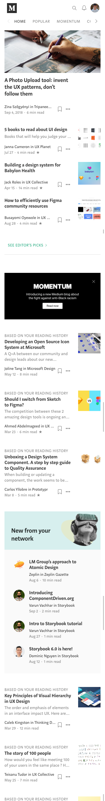
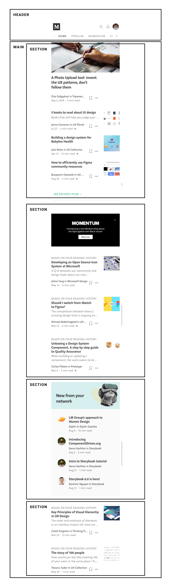
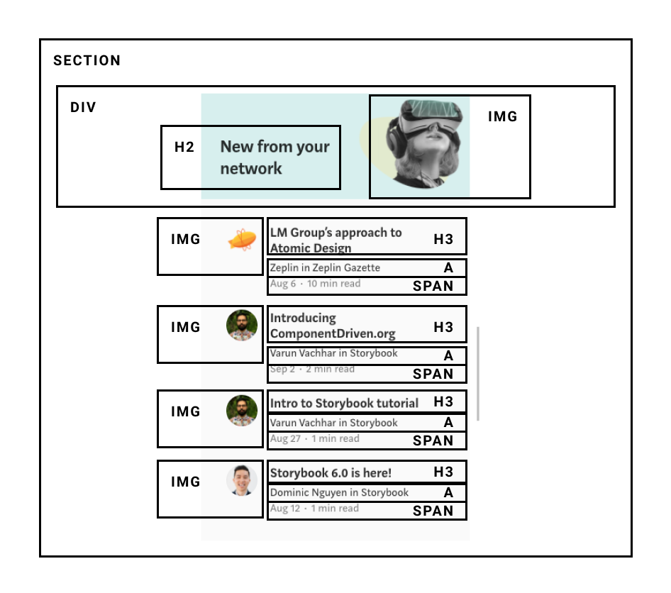

# [Project WEB 2020/2021](https://michavandijk.github.io/project-web-2021/)
#### Procesverslag
##### Auteur: Micha van Dijk

## Intake (week 1)

**Je startniveau:** Rood

**Je focus:** Surface plane

**Je opdracht:** [Medium](https://medium.com/ )

**Screenshot(s):**

**Breakdown-schets(en):**

## Proces

### Week 1
Deze week is begonnen met een kick-off door Sanne. Hier werd de algemene planning van het project verteld, dit was prettig zodat je wist wat er per week van je verwacht werd. De rest van de week stond in het teken van typografie en het maken van de intake. De manier waarop je kunt oefenen in CodePen is zeer prettig. Het enige nadeel van CodePen vind ik wel dat je alle code exact zelf moet schrijven en niet zoals in VSCode of een ander code programma op 'tab' kunt drukken waardoor je een stuk sneller bent.

[Oefening 1 - Typografie](https://codepen.io/michavandijk/pen/XWdevWe) 
[Oefening 2 - Typografie](https://codepen.io/michavandijk/pen/ExKwqxo)

### Week 2
Week 2 ging over positioneren en flexbox. Dit weekje was redelijk gemakkelijk voor mij. Beide CSS 'functies' heb ik ook veel gebruikt tijdens vorige opdrachten en op mijn werk. Ik kon dus ook tussendoor al een start gaan maken aan mijn eigen website (medium.com). Dit was wel andere koek en begon lastig door de header na te bouwen. Al gauw kwam ik erachter dat je een div nodig had om goed te kunnen flexen. Na het gebruik van de div was het appeltje eitje en ben ik nog even gaan zoeken of het ook mogelijk was zonder div, helaas is dat niet gelukt.

[Oefening 1 - Positioneren](https://codepen.io/michavandijk/pen/JjXMrMQ) 

[Oefening 1 - Flexbox](https://codepen.io/michavandijk/pen/yLOKPKQ) 
[Oefening 2 - Flexbox](https://codepen.io/michavandijk/pen/RwaMjyp)

### Week 3
De derde week van het vak stond in het teken van basic JavaScript en het opleveren van de eerste versie van je website. Om te starten met JavaScript: dit was wel weer even hard nadenken en goed research doen. Ik had al ruim 1,5 jaar geen JavaScript meer aangeraakt, maar wanneer ik eenmaal de oefeningen aan het maken was, ging het redelijk rap en pikte ik al gauw weer de code op. Ik heb hierdoor niet alle oefeningen afgemaakt, omdat er ook nog een hoop werk aan de winkel was voor mijn eigen website. Hier heb ik de volledige HTML structuur afgemaakt en heb de eerste pagina afgestyled. Ik kwam wel tot de conclusie dat het bouwen van de navigatie-slider iets te veel van het goede was en heb ik overleg met Janno besloten deze code te 'stelen'. Ik heb hier geen tijd meer voor gehad in dezelfde week.

[Oefening 1 - JavaScript](https://codepen.io/michavandijk/pen/XWdYgZP) 
[Oefening 2 - JavaScript](https://codepen.io/michavandijk/pen/QWNxgPQ)

#### Voortgang 1
Tijdens het voortgangsgesprek heb ik mijn website laten zien en toegelicht waarom ik bepaalde keuzes had gemaakt m.b.t. de code. Janno was zeer verrast dat ik alles voor elkaar had gekregen zonder een class te gebruiken. Ik had alleen gebruik gemaakt van pseudo elementen in de CSS. Echter wel wat feedback gekregen op het gebruik van !important achter enkele CSS-regels. Dit was niet toegestaan en moest dan ook nog aangepast/ verbeterd worden.

### Week 4
In de vierde week gingen we aan de slag met CSS-grid en media queries. Met grid ben ik tot op heden nog weinig mee in aanraking gekomen, waardoor dit toch wel wat uitdagender was. De oefeningen van CSS Grid Garden waren ontzettend handig om te kunnen starten met de basics. Maar wanneer je het moest gaan toepassen in de oefeningen was het toch wel wat lastiger. Hierdoor kostte het een hoop tijd en heb ik de opdrachten niet allemaal afgemaakt. Ik ging CSS Grid toch niet gebruiken in mijn eindproject en vond het belangrijker om daar meer tijd in te steken.

Het tweede deel van de week ging over media queries, dit was erg makkelijk. Hier was ik al vaker mee in aanraking gekomen, maar los daarvan zijn media queries ook gemakkelijk te begrijpen. Dat was ook te merken aan mijn mede-studenten. De CSS die echter werd gevraagd bij sommige opdrachten was een stuk complexer, dit vond ik persoonlijk wat onnodig voor wat er geleerd moest worden.

In deze week ben ik verder gegaan met het oplossen van mijn !important-problemen en het starten aan de tweede pagina van Medium. De importants waren gemakkelijk op te lossen, het probleem lag bij de selectoren. De selectoren waren te specifiek en niet specifiek genoeg op sommige punten.

### Week 5
In week 5 begonnen we met animeren, leuk! Ik heb vooral gemerkt dat je met CSS veel meer kunt animeren dan ik in eerste instantie dacht. Eigenlijk lijkt het op een uitgeschreven Adobe After Effects project. De oefeningen waren goed te doen, maar wel een hoop van hetzelfde. Ik heb oefening 1 dan ook niet helemaal afgemaakt en ben doorgegaan met mijn eigen website. Hier heb ik de volledige tweede pagina van af kunnen maken. Deze was een stuk simpeler dan de homepage en ik kon veel code hergebruiken. 

Daarnaast heeft Janno aan mij gevraagd of ik een lijstje wil opstellen met de mini-projecten voor de surfacelaag. Ik heb besloten de volgende punten extra aandacht te gaan geven:
- Clap-animatie op artikelniveau
- Scrollbare navigatie op de homepage
- Reactie plaatsen en daadwerkelijk tonen