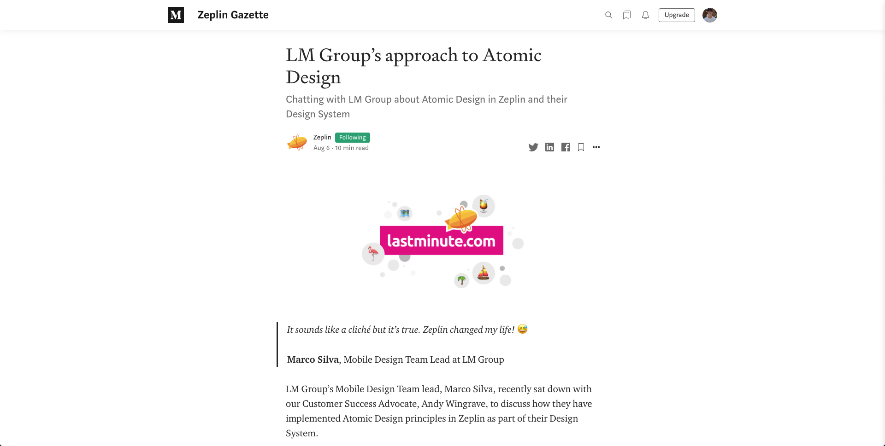

# [Project WEB 2020/2021](https://michavandijk.github.io/project-web-2021/)
#### Procesverslag
##### Auteur: Micha van Dijk

## Intake (week 1)

**Je startniveau:** rood

**Je focus:** surface plane

**Je opdracht:** [Medium](https://medium.com/ )

**Screenshot(s):**

**Breakdown-schets(en):**

<!-- ## Bronnenlijst
1. -bron 1-

## Voortgang

### Voortgang 1 (week 3)

-same as voortgang 1-

### Voortgang 2 (week 5)

-same as voortgang 1-

### Voortgang 3 (week 6)

#### Stand van zaken

-dit ging goed & dit was lastig-

**Screenshot(s):**

-screenshot(s) van hoe ver je bent-

## Agenda voor meeting

-samen met je groepje opstellen-

### Verslag van meeting

-na afloop snel uitkomsten vastleggen-

## Eindgesprek (week 7/8)

-dit ging goed & dit was lastig-

**Screenshot(s):**

-screenshot(s) van je eindresultaat- -->